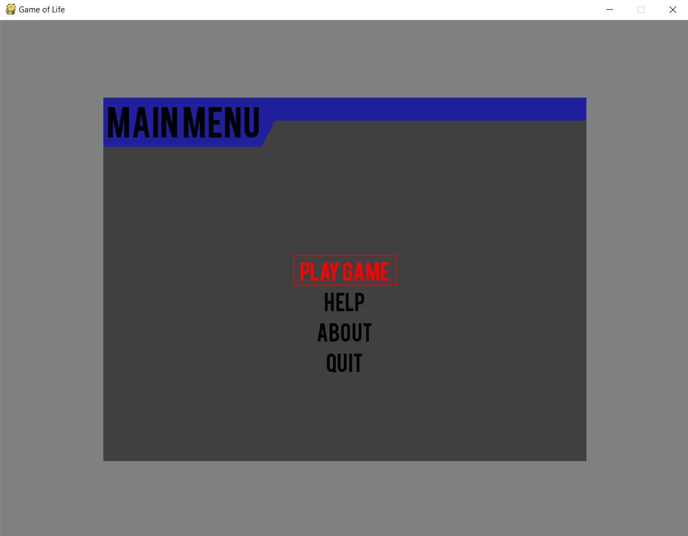
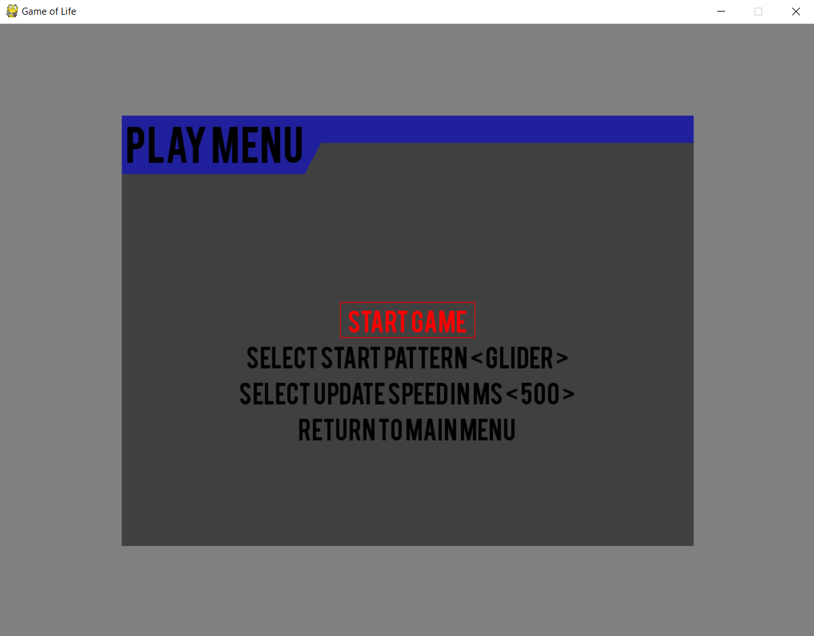
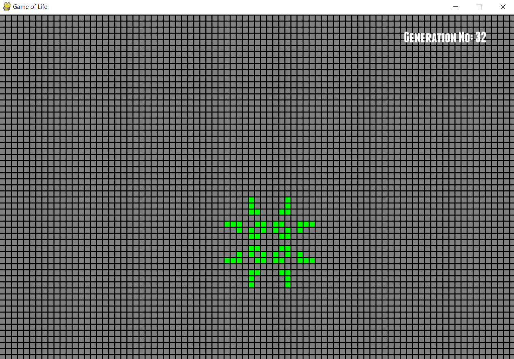
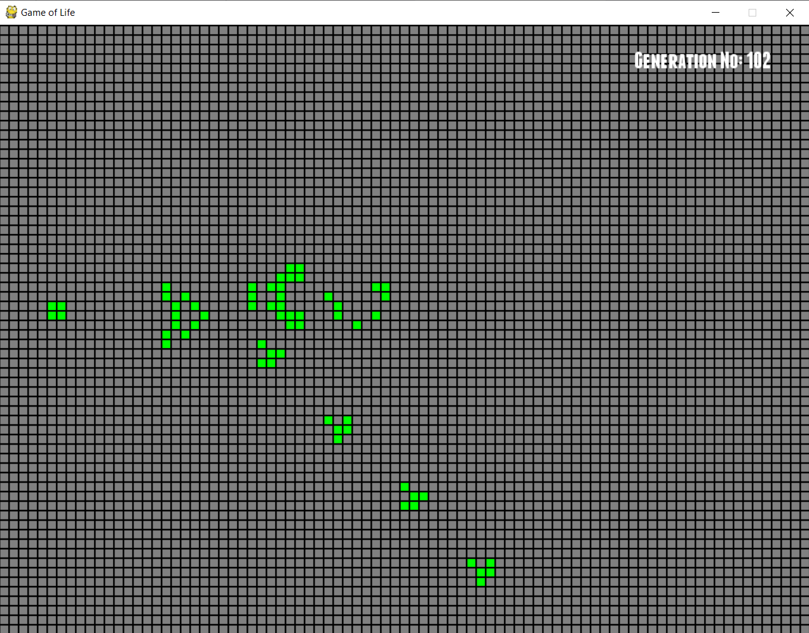

# 🧫 Game of Life

## A Python Implementation of John Conway’s Classic Cellular Automaton

**Game of Life** is a Python-based simulation of **John Conway’s** renowned cellular automaton.
This version includes variable **start patterns** and **update speeds**, allowing players to explore the fascinating emergent behavior of life-like systems through interactive control.

---

### 🧩 Rules of the Game

The **Game of Life** follows a simple set of rules that lead to complex and often surprising patterns.

#### For a cell that is **alive**:

* Any cell with **one or no neighbors** dies → *Isolation*
* Any cell with **four or more neighbors** dies → *Overpopulation*
* Any cell with **two or three neighbors** survives → *Survival*

#### For a cell that is **dead**:

* Any cell with **exactly three neighbors** becomes alive → *Reproduction*

---

### ⚙️ Installation

#### 🧩 Dependencies

Install the required dependencies with:

```bash
pip install pygame pygame-menu==1.96.1
```

---

### 🚀 Usage

Run the program from the terminal:

```bash
python3 game_of_life.py
```

---

### 🕹️ Gameplay Overview

#### 🧭 Main Menu

The **Main Menu** allows players to navigate between the **Play Menu**, **Help**, and **About** sections.

* The **Help Menu** explains game controls.
* The **About Menu** lists details about the game and its purpose.

<p align="center">
  
</p>

---

#### ⚙️ Play Menu

In the **Play Menu**, players can:

* Choose a **starting pattern** from a variety of classic configurations.
* Adjust the **update delay (ms)** — smaller values cause the simulation to run faster.

**Available Start Patterns:**
`Glider`, `Beacon`, `Toad`, `Blinker`, `Tetromino`, `Pulsar`, `Light Weight Spaceship`, `Copperhead Spaceship`, `Weekender`, `Gosper Glider Gun`, and `Random`.

<p align="center">
  
</p>

---

#### 🧬 In-Game Screenshots

**Pulsar Pattern**

<p align="center">
  
</p>

**Gosper Glider Gun**

<p align="center">
  
</p>

---

### 🧠 Technical Notes

* Built using **Pygame** and **pygame-menu** for an interactive interface.
* Includes real-time simulation updates and adjustable frame delay.
* Demonstrates emergent complexity from simple rule-based systems.

---

### 🧠 Possible Enhancements

* Save and load custom configurations.
* Introduce grid size and color customization options.
* Add visual history trails for live cell movement.

---

### 📜 License

This project is released under the **MIT License** — you are free to use, modify, and distribute it with attribution.

---

### 👨‍💻 Author

## Contact

* **Nipuna H. Weeratunge** – [GitHub](https://github.com/darkcyberwizard) | [Email](mailto:nipuna.h.weeratunge@gmail.com)

---
